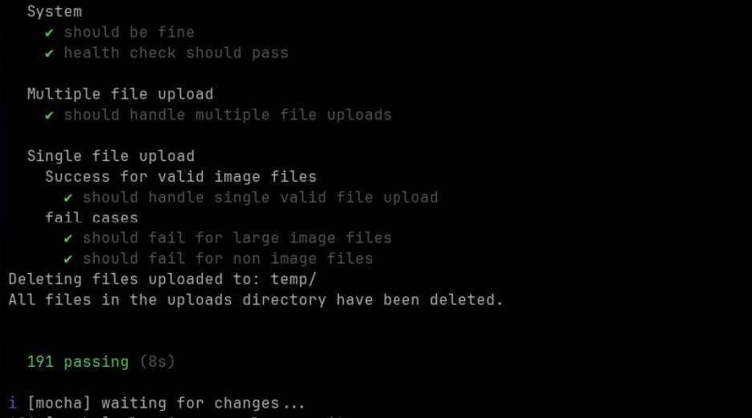

# E-commerce API

Backend for a MERN (MongoDB, Express, React, Node.js) e-commerce application. Built with TypeScript, Mongoose, JWT refresh-token auth, and multer for file uploads.

## Tech Stack

- **Runtime:** Node.js + TypeScript (run via `tsx`)
- **Framework:** Express
- **Database:** MongoDB (Mongoose)
- **Auth:** JWT access + refresh tokens (stored in cookies), Argon2 password hashing
- **Validation:** zod
- **Uploads:** multer
- **Logging:** winston with daily rotate
- **Testing:** mocha + supertest + mongodb-memory-server



## Getting Started

### Prerequisites

- Node.js 18+
- pnpm, npm, or yarn
- A running MongoDB instance (local or Atlas)

### Install

```bash
npm install
```

### Environment variables

Copy `.env.example` to `.env` and fill in the values:

```bash
cp .env.example .env
```

| Variable                   | Description                             | Default                              |
| -------------------------- | --------------------------------------- | ------------------------------------ |
| `PORT`                     | Server port                             | `4000`                               |
| `MONGO_URL`                | MongoDB connection string               | `mongodb://127.0.0.1:27017/rest-api` |
| `UPLOAD_PATH`              | Directory for uploaded images           | `uploads/`                           |
| `ACCESS_TOKEN_PRIVATE_KEY` | Private key for signing access tokens   |                                      |
| `ACCESS_TOKEN_PUBLIC_KEY`  | Public key for verifying access tokens  |                                      |
| `REFRESH_PRIVATE_KEY`      | Private key for signing refresh tokens  |                                      |
| `REFRESH_PUBLIC_KEY`       | Public key for verifying refresh tokens |                                      |
| `ACCESS_TOKEN_TTL`         | Access token lifetime                   | `15m`                                |
| `REFRESH_TOKEN_TTL`        | Refresh token lifetime                  | `1y`                                 |

### Running the server

```bash
npm run dev
```

The API will be available at `http://localhost:4000` (see the CORS origin in `src/server.ts`; the frontend is expected on port `5173`).

### Production build

```bash
npm run build
```

## Project Structure

```
src/
├── app.ts                 # Entry point: starts the server and connects to DB
├── server.ts              # Express app setup (cors, body parsing, error/404 handlers)
├── env.ts                 # Environment config
├── routes/index.ts        # Route definitions
├── middleware/            # Express middleware (e.g. auth)
├── application/           # Core layer: usecases, entities, boundaries
│   ├── usecases/          # Business logic (auth, cart, product, address...)
│   ├── entities/          # Domain entities
│   └── boundaries/        # Repository/entity gateway interfaces
├── infra/ (infrastructure)/multer # Upload config
├── impl/                  # Implementations
│   ├── controllers/       # Route handlers (health, auth, products, admin, ...)
│   ├── commands/          # Command implementations (auth, cart, address...)
│   ├── mongoose/          # Mongoose models & record types
│   └── services/repo      # Repository implementations
├── test/                  # Unit & integration tests
└── utils/                 # Helpers (jwt, validation, logger, db connection...)
```

## API Endpoints

### Health

| Method | Route     | Description  |
| ------ | --------- | ------------ |
| GET    | `/health` | Health check |

### Auth

| Method | Route              | Description                 |
| ------ | ------------------ | --------------------------- |
| POST   | `/signup`          | Create a user account       |
| POST   | `/login`           | Log in and set auth cookies |
| POST   | `/api/auth/logout` | Log out (clear cookies)     |
| GET    | `/refresh`         | Refresh the access token    |
| GET    | `/me`              | Get current user details    |

### Products

| Method | Route                                   | Description                  |
| ------ | --------------------------------------- | ---------------------------- |
| POST   | `/api/admin/products/add`               | Add a product (admin)        |
| PUT    | `/api/admin/products/edit/:productId`   | Edit a product (admin)       |
| DELETE | `/api/admin/products/delete/:productId` | Delete a product (admin)     |
| GET    | `/api/admin/products/get`               | List all products (admin)    |
| GET    | `/products`                             | List all products            |
| GET    | `/api/shop/products/get`                | Get filtered products (shop) |
| GET    | `/products/:productId`                  | Get product details          |

### Featured Images

| Method | Route                             | Description            |
| ------ | --------------------------------- | ---------------------- |
| POST   | `/api/common/feature/add`         | Add a feature image    |
| GET    | `/api/common/feature/get`         | Get feature images     |
| POST   | `/api/admin/feature/upload-image` | Upload a feature image |
| GET    | `/feature-images/:filename`       | Serve a feature image  |

### Product Images

| Method | Route                                      | Description            |
| ------ | ------------------------------------------ | ---------------------- |
| GET    | `/prod-imgs/:filename`                     | Serve a product image  |
| GET    | `/product-images/:filename`                | Serve a product image  |
| POST   | `/api/admin/products/upload-product-image` | Upload a product image |

### Addresses

| Method | Route                   | Description     |
| ------ | ----------------------- | --------------- |
| POST   | `/addresses`            | Add an address  |
| PATCH  | `/addresses/:addressId` | Edit an address |

### Cart

| Method | Route               | Description |
| ------ | ------------------- | ----------- |
| POST   | `/cart/add-to-cart` | Add to cart |

> Note: Some routes/features (e.g. `generateKey`, upload helpers) are marked as work-in-progress in the code.

## Scripts

| Command           | Description                                  |
| ----------------- | -------------------------------------------- |
| `npm run dev`     | Run the server with hot reload (`tsx watch`) |
| `npm run build`   | Compile TypeScript with `tsc`                |
| `npm test`        | Run tests in watch mode                      |
| `npm run ci:test` | Run tests once (CI)                          |
| `npm run utest`   | Run unit tests (watch)                       |
| `npm run itest`   | Run integration tests (watch)                |
| `npm run snoop`   | Type-check in watch mode                     |
